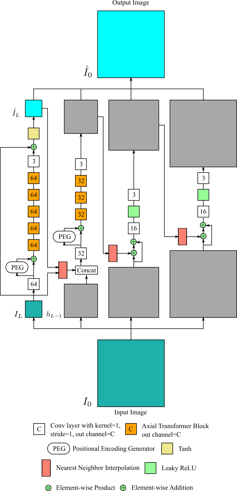

# LPTT

> **Title** <br>


The network structure of LPTT:



#### Getting started

- Clone this repo.
```bash
git clone https://github.com/KeiShiba-1218/LPTT
cd LPTT
```

- Install dependencies. (Python 3 + NVIDIA GPU + CUDA. Recommend to use Anaconda)
```bash
pip install -r requirement.txt
```

- Download dataset.
The same dataset as Laplacian Pyramid Translation Network is used in our experiments.
Please download dataset following [the repository](https://github.com/csjliang/LPTN)

#### Training

First, check and adapt the yml file ```options/train/LPTT/train_FiveK.yml```, then

- Single GPU:
```bash
PYTHONPATH="./:${PYTHONPATH}" CUDA_VISIBLE_DEVICES=0 python codes/train.py -opt options/train/LPTT/train_FiveK.yml
```

- Distributed Training:
```bash
PYTHONPATH="./:${PYTHONPATH}" CUDA_VISIBLE_DEVICES=0,1,2,3 python -m torch.distributed.launch --nproc_per_node=4 --master_port=4321 codes/train.py -opt options/train/LPTT/train_FiveK.yml --launcher pytorch
```

Training files (logs, models, training states and visualizations) will be saved in the directory ```./experiments/{name}```

#### Evaluation

First, check and adapt the yml file ```options/test/LPTT/test_FiveK.yml``` and ```options/test/LPTT/test_speed_FiveK.yml```, then

- Calculate metrics and save visual results:
```bash
PYTHONPATH="./:${PYTHONPATH}" CUDA_VISIBLE_DEVICES=0 python codes/test.py -opt options/test/LPTT/test_FiveK.yml
```

- Test inference speed:
```bash
PYTHONPATH="./:${PYTHONPATH}" CUDA_VISIBLE_DEVICES=0 python codes/test_speed.py -opt options/test/LPTT/test_speed_FiveK.yml
```

Evaluating files (logs and visualizations) will be saved in the directory ```./results/{name}```

#### Use Pretrained Models

- Download the pretrained model from [GoogleDrive](https://drive.google.com/file/d/1Rv9BcY7QUqHR5oQtj9fM1L9jLnq2vXi8/view?usp=sharing) and move it to the directory ```experiments/pretrained_models```:

- Specify the ```path: pretrain_network_g``` in ```test_FiveK.yml``` and run evaluation.

### Acknowledgement
We borrowed the many codes from the great [LPTN](https://github.com/csjliang/LPTN) repo.
